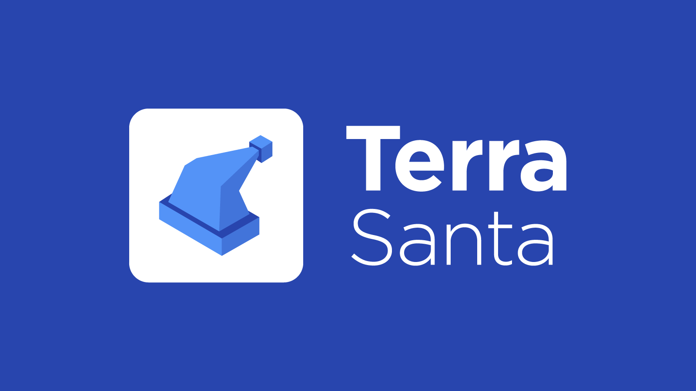

# Santa 



[](https://codecov.io/gh/terra-project/santa)

Santa subsidizes block rewards for Terra's Columbus mainnet. It is intended to support the security of the network until Terra transaction volume (and attendent staking returns from transaction fees) has had sufficient time to mature. Read [here](./MOTIVATION.md) for more details on the project motivation. 


## Mechanism

The config file looks something like the following: 
```
key_dir: ...
node: ...
trigger_interval: 1 
fee_amount: 1000000uluna 
```

Every `trigger_interval` number of blocks on Columbus, Santa sends a transaction containing `1 uluna` with `fee_amount` of fees to itself. Effectively, this scheme allows Santa to subsidize block rewards by paying fees over periodic block intervals. 

For example, in order to subsidize 21.6 million Luna tokens every block over 1 year, one needs to set `trigger_interval` to 1, and `fee_amount` to `21.6 million / (3.154e+7 / 6.5) * 10^6 = 4451490 uluna`. 

## Status

An instance of Santa is currently being jointly operated and supported by several top validators in the network:

```
A-Team
Arrington XRP Capital
B-Harvest
Certus One
ChainLayer
Chorus One
Dokia Capital
Figment Network
Ghost
Goliath
Hashed
Healings
Marine
Polychain Labs
RockX
StakeWith.Us
Staking Fund
Terraforming
Wraith
100&100 Venture Capital
```

To kick off the process, the Goliath, Marine, Wraith and Ghost Validators have donated 21.7 million tokens to be distributed over the course of the next year, slightly above a 10% annualized return on currently staked tokens. You can see Santa hard at work here: https://finder.terra.money/columbus-2/account/terra13u66u4knssnws7n7w0n38mzyyqak5ygp807gyl

Some details on future operations: 
- **IMPORTANT**: Santa will operate independently of existing rewards from fees and swaps. As Terra transaction volume goes up, expected rewards may well be significantly higher than that provided by Santa.  
- Every time the number of staked tokens go up by more than 10 million tokens, the Goliath, Marine, Wraith and Ghost Validators are commiting to deposit an additional 1 million Luna to Santa to prevent reward dilution for existing stakeholders. No tokens will be withdrawn in the opposite case where the number of staked tokens go down. 
- Terra's validator community will actively monitor the network's reward dynamics and continue supporting Santa in the unlikely case that staking returns continue to lag behind the industry average. The Goliath, Marine, Wraith and Ghost Validators will commit up to 100 million Luna tokens for this purpose, which, at current parameters, sufficient to keep Santa running for the next five years. 
- Members of the community looking to support the network are either encouraged to either donate tokens to the [currently active Santa address](https://finder.terra.money/columbus-2/account/terra13u66u4knssnws7n7w0n38mzyyqak5ygp807gyl) or start their own instances of Santa. 

## Build & Install

First, check out the repo: 

```
$ git clone https://github.com/terra-project/santa.git
$ git checkout master
```

Then, build and install: 
```
$ make install
```

To initialize the config file for Santa:
```
$ santa config
```

To edit the config file: 
```
$ vim ~/.santa/config.yaml
```

To add a key to an account containing tokens to be doled out: 
```
$ santa keys add         
```

To recover a key: 
```
$ santa keys add  --recover
```

Finally: to start santa and have Christmas come early: 
```
$ santa start      
```
